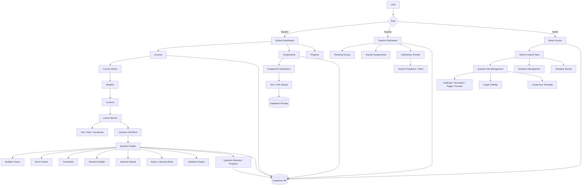
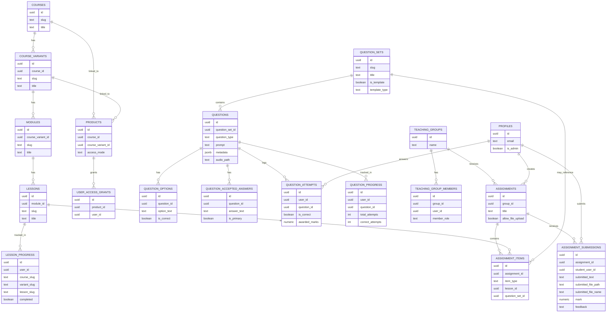

# GCSE Russian Course Platform

A full-stack online learning platform for GCSE Russian students, combining structured courses, interactive lessons, and a teacher-led assignment system.

Built as a real-world product powering **gcserussian.com** and supporting **Volna Online Russian School**.

---

## 🚀 Overview

This platform delivers a complete online learning experience, including:

- Structured course delivery (Foundation, Higher, Volna tracks)
- Block-based lesson system
- Advanced database-driven question engine
- Teacher → student assignment workflow
- File uploads and feedback system
- Role-based access (admin, teacher, student)
- Progress tracking (variant-aware)
- Template-driven content system (question sets)
- Scalable architecture for future expansion

---

## 🧠 Key Technical Features

### 🔹 Metadata-Driven Question Engine

- Questions are dynamically rendered using structured metadata
- Supports multiple answer strategies without hardcoding UI
- Easily extensible for new question types

### 🔹 Reusable Block-Based Lesson System

- Lessons are composed of modular blocks:
  - text
  - note
  - vocabulary
  - audio
  - question sets
- Enables fast content creation and consistency

### 🔹 Admin CMS (Custom Built)

- Full CRUD system for:
  - question sets
  - questions
  - options
  - accepted answers
- Advanced tools:
  - duplication
  - reordering
  - normalization
  - activation toggles
  - inline editing
  - template system
  - usage visibility

### 🔹 Question Set Templates

- Mark question sets as reusable templates
- Template type classification
- Guided “create from template” workflow
- Standardises content creation patterns

### 🔹 Usage Tracking System

- Tracks which assignments use each question set
- Helps prevent accidental deletion of in-use content
- Links directly to relevant assignment pages

### 🔹 Assignment System

- Teachers can:
  - create assignments
  - attach lessons and question sets
  - review submissions
  - give marks and feedback
- Students can:
  - complete tasks
  - upload files
  - receive feedback

### 🔹 Role-Based Architecture

- Admin → full system access
- Teacher → group + assignment management
- Student → course + homework access

### 🔹 Supabase Integration

- PostgreSQL database
- Row Level Security (RLS)
- Auth system
- File storage with signed URLs

---

## 🏗️ Architecture Overview

### Course Hierarchy

- Course
- Variant (Learning Track)
  - foundation
  - higher
  - volna
- Module
- Lesson

---

### URL Structure

- /courses/[courseSlug]
- /courses/[courseSlug]/[variantSlug]
- /courses/[courseSlug]/[variantSlug]/modules/[moduleSlug]
- /courses/[courseSlug]/[variantSlug]/modules/[moduleSlug]/lessons/[lessonSlug]

- /assignments
- /assignments/[assignmentId]

- /teacher/assignments
- /teacher/assignments/new
- /teacher/assignments/[assignmentId]

- /question-sets/[questionSetSlug]
- /admin
- /admin/question-sets
- /admin/question-sets/templates
- /admin/questions/[questionId]

---

## 🧩 System Architecture



---

## 🔐 Access System

### Tables

- products
- prices
- user_access_grants

### Access Modes

- trial
- full
- volna

### Key Logic

- Access is determined via `user_access_grants`
- Each grant links to a `product`
- Products define:
  - course
  - variant
  - access type

### Lesson-level flags

- is_trial_visible
- available_in_volna

---

## 👥 Roles

- Admin → `profiles.is_admin = true`
- Teacher → `teaching_group_members.member_role = teacher`
- Student → default

---

## 🎓 Volna System

### Tables

- teaching_groups
- teaching_group_members

### Features

- Teacher → student group management
- Volna-specific course variant
- Assignment distribution
- Homework review workflow

---

## 📝 Assignment System

### Tables

- assignments
- assignment_items
- assignment_submissions

### Assignment items

- lesson
- question set
- custom task

---

### Teacher Flow

- Create assignment
- Attach lessons
- Attach question sets
- Add custom tasks
- Review submissions
- Mark + give feedback

---

### Student Flow

- View assignments
- Access lesson + question sets
- Submit homework (text + file upload)
- View teacher feedback

---

## 🧩 Lesson System

Block-based architecture.

### Supported blocks

- text
- note
- vocabulary
- multiple choice
- short answer
- translation
- question set

### Location

- `src/components/lesson-blocks/`

---

## ❓ Question System

Database-driven.

### Tables

- question_sets
- questions
- question_options
- question_accepted_answers
- question_attempts
- question_progress

---

### Supported types

- multiple_choice
- short_answer
- translation

---

### Advanced Features

#### 🎧 Audio / Listening Mode

- Audio playback per question
- Max play limits
- Auto-play support
- Listening exam mode (restricted UI)
- Submission lock until audio completes

#### ✅ Validation Engine

- Case-insensitive matching
- Whitespace normalization
- Optional:
  - ignore punctuation
  - ignore articles

#### 🧠 Answer Strategies (metadata-driven)

- text_input
- selection_based
- sentence_builder
- upload_required (planned)

#### 🔘 Selection-based questions

- Grouped mode
- Inline gap mode

---

## 📊 Progress Tracking

### Tables

- lesson_progress
- question_progress

### Features

- Variant-aware tracking
- Per-question attempt tracking
- Best score + attempts stored

---

## 🧭 Dashboard System

Role-aware dashboard:

### Admin

- Full system visibility
- Content + assignment control
- Template management
- Usage visibility

### Teacher

- Group-based context
- Assignment management
- Submission review

### Student

- Learning track (foundation / higher / volna)
- Access type (trial / full / volna)
- Completed lessons

---

## 🗂️ Project Structure

```text
src/

  app/
    (platform)/
      dashboard/
      courses/
      assignments/
      teacher/
      question-sets/
    admin/

  components/
    admin/
    layout/
    ui/
    lesson-blocks/
    questions/
    assignments/

  lib/
    auth.ts
    teacher-auth.ts
    access.ts
    dashboard-helpers.ts
    assignment-helpers-db.ts
    question-helpers-db.ts
    course-helpers-db.ts
    access-helpers-db.ts
    question-engine.ts
    progress.ts
    routes.ts
    media.ts
    supabase/

  types/
```

---

## 🗄️ Database Overview

### Core Content

- courses
- course_variants
- modules
- lessons

### Questions

- question_sets
- questions
- question_options
- question_accepted_answers

### Progress

- lesson_progress
- question_progress
- question_attempts

### Assignments

- assignments
- assignment_items
- assignment_submissions

### Volna

- teaching_groups
- teaching_group_members

### Access

- products
- user_access_grants

---

## 🗄️ Database Relationship Overview



---

## 🔐 Storage & Security

- Supabase RLS enforced
- Admin override logic for restricted teacher/assignment views
- Private storage buckets
- Signed URLs for secure file access
- Assignment uploads scoped per user
- Server-side validation of access

---

## ⚙️ Tech Stack

- Next.js (App Router)
- React
- TypeScript
- Tailwind CSS
- Supabase (DB, Auth, Storage)
- Server Actions

---

## ⚙️ Environment Variables

Required in `.env.local`:

```env
NEXT_PUBLIC_SUPABASE_URL=
NEXT_PUBLIC_SUPABASE_ANON_KEY=
SUPABASE_SERVICE_ROLE_KEY=
```

---

## 🧑‍💻 Local Development

### 1. Install dependencies

```bash
npm install
```

### 2. Run dev server

```bash
npm run dev
```

### 3. Open app

```text
http://localhost:3000
```

---

## 🛣️ Future Improvements

- AI-assisted marking system
- Speaking exam system
- Audio recording tasks
- Payment integration
- Analytics dashboard
- Bulk admin actions (multi-select, batch operations)
- Advanced filtering/search in admin

---

## 👤 Author

**Anton Vlasenko**  
Director — Volna Online Russian School
