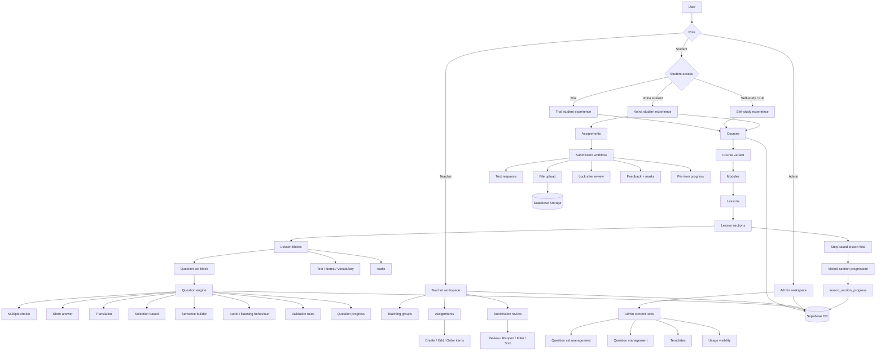
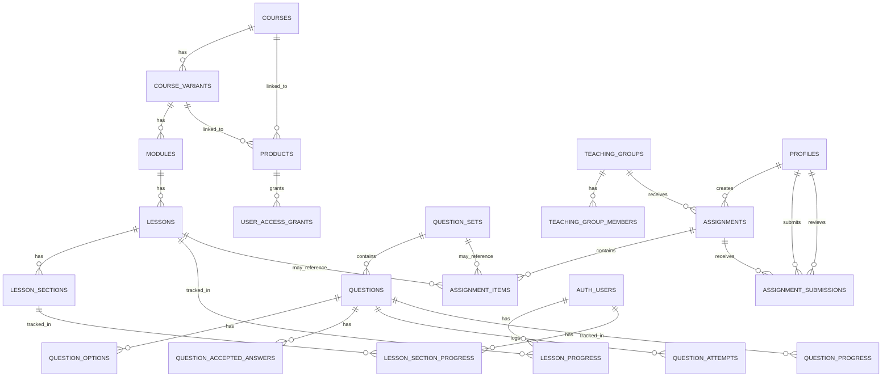

# Architecture Overview

This document describes the current system architecture of the GCSE Russian Course Platform.

It focuses on how the platform is organised today rather than trying to list every implementation detail.

---

## 1. Architectural model

The platform is shaped by **two separate axes**:

### Role axis

- Admin
- Teacher
- Student

### Student access axis

- Trial
- Self-study / Full
- Volna student

This distinction matters because the platform does not use separate apps for each student type. Instead, one codebase serves multiple student experiences through access logic, permissions, and UI differences.

---

## 2. High-level system architecture



---

## 3. Main architectural layers

### Presentation layer

Built with Next.js App Router and React.

Main concerns:

- dashboards
- course navigation
- lesson rendering
- student assignment views
- teacher review views
- admin authoring views

### Application logic layer

Implemented through server actions and helper modules in `src/lib/`.

Main concerns:

- authenticated writes
- data loading
- role-aware helpers
- assignment workflow logic
- question transformation and rendering support
- lesson step unlocking and section visit tracking

### Data layer

Supabase provides:

- PostgreSQL
- authentication
- storage
- row-level security

---

## 4. Core content architecture

### Course hierarchy

- Course
- Variant
- Module
- Lesson

### Lesson architecture

Lessons are block-based rather than page-specific.

That means a lesson is composed from reusable block types such as:

- text
- note
- vocabulary
- audio
- question set block

This keeps layout logic reusable and allows lesson content to grow without rewriting page structure.

### Section-based lesson flow

Lessons now also support a **section-based step system** on top of the block renderer.

This adds a second structural layer:

- Lesson
- Section
- Block

Sections are used for:

- breaking long lessons into steps
- pacing the student experience
- step-based navigation
- progressive unlocking
- visited-section tracking

### Current student lesson behaviour

- lessons open on a current section
- first visit to a section is recorded in the database
- visiting a section unlocks the next section
- previously visited sections remain accessible
- students cannot skip arbitrarily ahead beyond the allowed progression
- manual lesson completion still exists separately from section visits

### Question architecture

Questions are database-driven and metadata-driven.

The engine is built so one rendering system can support many behaviours, rather than one custom component per question variation.

This supports:

- multiple choice
- short answer
- translation
- selection-based workflows
- listening rules
- sentence-builder style interactions

---

## 5. Assignment architecture

The assignment system now works as a full teacher-student workflow.

### Assignment entities

- `assignments`
- `assignment_items`
- `assignment_submissions`

### Assignment item types

- lesson
- question set
- custom task

### Current workflow

Teachers can:

- create assignments
- edit assignments
- order assignment items
- review submissions
- save marks and feedback
- reopen reviewed submissions
- filter and sort review queues

Students can:

- view assignments
- follow ordered items
- submit text and optional files
- get locked after review
- see review results
- see per-item progress

### Important implementation detail

Teacher-facing assignment status is **derived from submission data**, not trusted from an assignment-level label alone.

That enables states such as:

- no submissions
- pending review
- reviewed

This is more useful operationally than a flat assignment status field.

---

## 6. Progress architecture

Progress currently exists in more than one place because different kinds of work need different tracking.

### Lesson progress

Stored in `lesson_progress`.

Used for:

- completed lesson state
- assignment lesson item progress

### Lesson section progress

Stored in `lesson_section_progress`.

Used for:

- first-visit tracking per section
- revisit timestamps and visit count
- lesson step unlocking
- honest visited-section progress UI

Tracked fields include:

- `first_visited_at`
- `last_visited_at`
- `visit_count`

### Question progress

Stored through:

- `question_attempts`
- `question_progress`

Used for:

- question activity
- score history
- question-set started state
- assignment question set progress

### Assignment progress

Assignment progress is currently assembled from the underlying learning systems rather than stored as a single separate progress record.

That means:

- lesson items use lesson completion
- question set items use question activity
- custom tasks remain teacher-defined work without automatic completion tracking

### Key progress design decision

Section progression is currently **visit-based**, not explicit section-completion-button based.

That decision was made to avoid:

- repetitive click-heavy UX
- fake completion actions
- unnecessary friction in long lessons

This keeps lesson flow smoother while still creating real, DB-backed progress state.

---

## 7. Admin content system

The platform includes a custom admin CMS for question content rather than relying on direct database editing.

It currently supports:

- question set CRUD
- question CRUD
- option / accepted answer editing
- duplication
- reordering
- template workflows
- usage visibility

This is important architecturally because it keeps reusable educational content in a managed system, not in ad hoc SQL operations.

### Lesson authoring status

Lesson content architecture has moved forward during this phase, but it is still in a **hybrid state**.

Current state:

- lesson progression and section progress are DB-backed
- student lesson step flow is DB-aware
- lesson block rendering is reusable
- lesson content authoring is **not yet fully CMS-driven in the same way as question sets**

This is an important architectural boundary because the next major step is to make lessons fully database-authored through admin tools.

---

## 8. Access and permission architecture

### Role handling

- admin visibility uses `profiles.is_admin`
- teacher access is group-aware
- student access is default authenticated access

### Access modes

Student experience is additionally shaped by product/access rules such as:

- trial
- full
- volna

### Security model

Security is enforced through a combination of:

- route-level checks
- helper-level permission-aware queries
- Row Level Security policies in Supabase

This is why some helper functions include admin-aware logic even when route access is already gated.

---

## 9. Database relationships



### Important lesson-progress distinction

There are now **two separate lesson progress layers**:

1. `lesson_progress`
   - lesson-level completion
   - manual completion state
   - used by assignment lesson items

2. `lesson_section_progress`
   - section-level visitation
   - step unlocking
   - visited-section UX state

This separation is intentional and avoids overloading one table with two different concepts.

---

## 10. Representative file structure

This is intentionally representative rather than exhaustive.

```text
src/
  app/
    (platform)/
      dashboard/
      courses/
      assignments/
      teacher/
      question-sets/
    admin/
    actions/

  components/
    admin/
    assignments/
    layout/
    lesson-blocks/
    questions/
    ui/

  lib/
    access.ts
    access-helpers-db.ts
    assignment-helpers-db.ts
    assignment-progress.ts
    auth.ts
    course-helpers-db.ts
    dashboard-helpers.ts
    progress.ts
    question-engine.ts
    question-helpers-db.ts
    question-progress.ts
    routes.ts
    storage-helpers.ts
    teacher-auth.ts
    supabase/

  types/
```

### Files made more important by this phase

The following architectural areas now matter more because of the lesson-section system:

- `src/lib/progress.ts`
- student lesson page template / section navigation components
- lesson rendering helpers
- future lesson authoring helpers
- future lesson-section-aware admin authoring flows

---

## 11. Tech stack

- Next.js (App Router)
- React
- TypeScript
- Tailwind CSS
- Supabase
- Server Actions

---

## 12. Current architectural strengths

The platform now has several strong foundations:

- one shared system for multiple student experiences
- reusable lesson renderer
- reusable metadata-driven question engine
- real teacher assignment workflow
- custom admin tooling for scalable content production
- security model aligned across route checks, helpers, and RLS
- assignment UX that reflects operational review state rather than raw record status
- **section-based lesson progression with DB-backed visit tracking**
- **clean separation between lesson completion and section visitation**

---

## 13. Likely next architectural evolutions

The current architecture is strong enough to support future additions such as:

- payments and billing-driven access
- speaking workflows
- richer analytics
- deeper progress summaries
- broader admin content operations
- full DB-driven lesson content authoring
- section-level quizzes/checkpoints
- richer lesson engagement analytics
- future true section-completion logic, if needed
