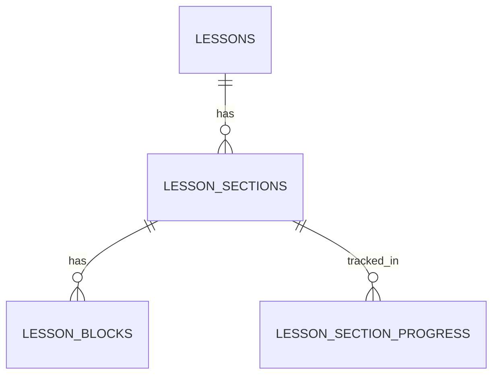

# Architecture Overview

This document describes the current system architecture of the GCSE Russian Course Platform.

It focuses on how the platform is organised today rather than trying to list every implementation detail.

---

## 1. Architectural model

The platform is shaped by **two separate axes**:

### Role axis

- Admin
- Teacher
- Student

### Student access axis

- Trial
- Self-study / Full
- Volna student

This distinction matters because the platform does not use separate apps for each student type. Instead, one codebase serves multiple student experiences through access logic, permissions, and UI differences.

---

## 2. High-level system architecture

```mermaid
flowchart TD

  U[User] --> R{Role}

  R -->|Student| S{Student access}
  R -->|Teacher| T[Teacher workspace]
  R -->|Admin| A[Admin workspace]

  S -->|Trial| ST[Trial student experience]
  S -->|Self-study / Full| SS[Self-study experience]
  S -->|Volna student| SV[Volna student experience]

  ST --> C[Courses]
  SS --> C
  SV --> C
  SV --> ASG[Assignments]

  C --> CV[Course variant]
  CV --> M[Modules]
  M --> L[Lessons]

  L --> SEC[Lesson sections]
  SEC --> STEP[Step-based lesson flow]
  SEC --> LB[Lesson blocks]
  STEP --> VIS[Visited-section progression]
  VIS --> LSP[lesson_section_progress]

  LB --> TXT[Text / Notes / Vocabulary]
  LB --> AUD[Audio]
  LB --> IMG[Image]
  LB --> CALLOUT[Callout / Exam tip]
  LB --> QSB[Question set block]

  QSB --> QE[Question engine]
  QE --> MCQ[Multiple choice]
  QE --> SA[Short answer]
  QE --> TRN[Translation]
  QE --> SEL[Selection based]
  QE --> SB[Sentence builder]
  QE --> AU[Audio / listening behaviour]
  QE --> VAL[Validation rules]
  QE --> QP[Question progress]

  T --> TG[Teaching groups]
  T --> TA[Assignments]
  T --> TR[Submission review]

  TA --> AC[Create / Edit / Order items]
  TR --> RV[Review / Reopen / Filter / Sort]

  A --> CMS[Admin CMS]
  CMS --> CONTENT[Courses / Variants / Modules / Lessons]
  CMS --> BUILDER[Lesson Builder (sections + blocks)]
  CMS --> QS[Question sets]
  CMS --> QQ[Questions]
  CMS --> TMP[DB Templates]
  CMS --> USERS[Students / Teachers]
  CMS --> GROUPS[Teaching groups]
  CMS --> ACCESS[Access grants + roles]

  ASG --> SUB[Submission workflow]
  SUB --> TXT2[Text response]
  SUB --> FILE[File upload]
  SUB --> LOCK[Lock after review]
  SUB --> FB[Feedback + marks]
  SUB --> PROG[Per-item progress]

  C --> DB[(Supabase DB)]
  QE --> DB
  T --> DB
  A --> DB
  LSP --> DB
  FILE --> STOR[(Supabase Storage)]
```

---

## 3. Main architectural layers

### Presentation layer

Built with Next.js App Router and React.

Main concerns:

- dashboards
- course navigation
- lesson rendering
- student assignment views
- teacher review views
- admin authoring views
- **lesson builder UI (NEW)**

### Application logic layer

Implemented through server actions and helper modules in `src/lib/`.

Main concerns:

- authenticated writes
- data loading
- role-aware helpers
- assignment workflow logic
- question transformation and rendering support
- admin CMS orchestration
- lesson step unlocking and section visit tracking
- **lesson builder actions (NEW)**

### Data layer

Supabase provides:

- PostgreSQL
- authentication
- storage
- row-level security

---

## 4. Core content architecture

### Course hierarchy

- Course
- Variant
- Module
- Lesson

### Lesson architecture (UPDATED)

Lessons now use a **two-layer structure**:

- Lesson
- Section
- Block

### Section-based lesson flow

Sections enable:

- step-based learning
- progressive unlocking
- structured pacing
- better UX for long lessons

### Block system (EXPANDED)

Blocks now include:

- text
- note
- vocabulary
- audio
- image
- callout
- exam tip
- header / subheader / divider
- question set

### Key architectural shift

- ❌ Removed hardcoded lesson templates
- ❌ Removed hardcoded block presets
- ✅ All lesson content is DB-driven
- ✅ Templates resolved via DB helpers

---

## 5. Lesson Builder Architecture (NEW)

The lesson builder is now a **core CMS system**.

### Capabilities

- Section CRUD
- Block CRUD
- Ordering via position fields
- Drag-and-drop UI
- Cross-section block movement
- Inspector-based editing
- Publish/unpublish state

### Key design decisions

- Builder writes directly to DB tables
- UI reflects DB state (no intermediate abstraction)
- Position-based ordering avoids complex tree structures
- No dependency on static presets

---

## 6. Progress architecture

### Lesson progress

- lesson_progress → completion

### Section progress (NEW)

- lesson_section_progress → visitation

Tracks:

- first_visited_at
- last_visited_at
- visit_count

### Key design decision

Progression is **visit-based**, not completion-button based.

---

## 7. Database relationships (UPDATED)



---

## 8. Architectural changes in this phase

### Major upgrades

- Section-based lesson system
- DB-backed progression tracking
- Full lesson builder CMS
- DB-driven templates

### Major removals

- Hardcoded lesson presets
- Static template files

### Improvements

- Cleaner architecture
- Scalable lesson system
- CMS-driven content

---

## 9. Architectural strengths

- Fully DB-driven content system
- Strong separation of concerns
- Reusable lesson + question engines
- Scalable CMS
- Clean progression model

---

## 10. Next architectural steps

- autosave in builder
- richer block types
- section-level validation/quizzes
- analytics
- payments integration
- speaking system
