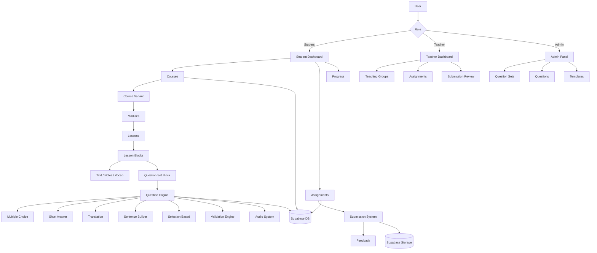
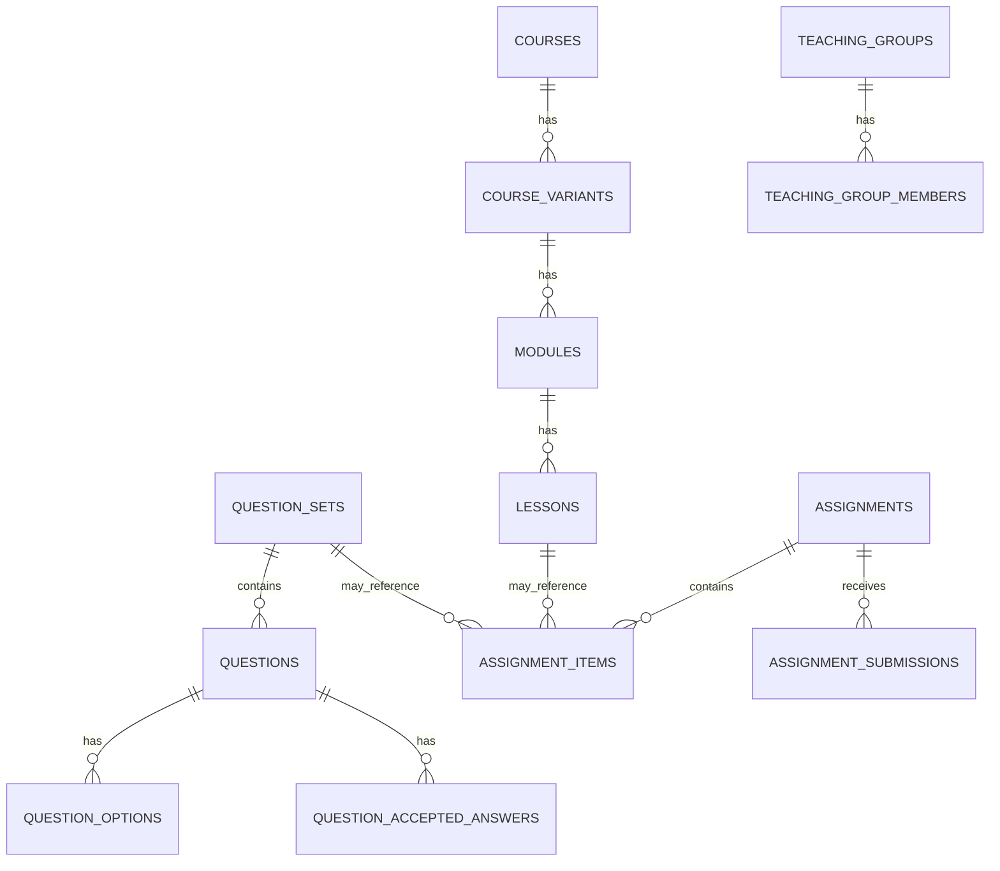

# Architecture Overview

This document outlines the system architecture of the GCSE Russian Course Platform.

---

## 🧩 High-Level System Architecture

---

## 🗄️ Database Relationships

---

## 🧠 Key Architectural Decisions

### Metadata-driven question system

Questions are defined using flexible metadata rather than rigid schemas, allowing:

- multiple answer strategies
- easy extension
- reusable UI components

---

### Block-based lesson design

Lessons are composed of reusable blocks:

- improves consistency
- simplifies content creation
- allows future expansion

---

### Role-based access with Supabase RLS

- Student, Teacher, Admin roles
- Admin override logic for management views
- Secure data isolation

---

### Template system

- Standardises question creation
- Speeds up content production
- Reduces duplication errors

---

## ⚙️ Tech Stack

- Next.js (App Router)
- React + TypeScript
- Tailwind CSS
- Supabase (PostgreSQL, Auth, Storage)
- Server Actions
