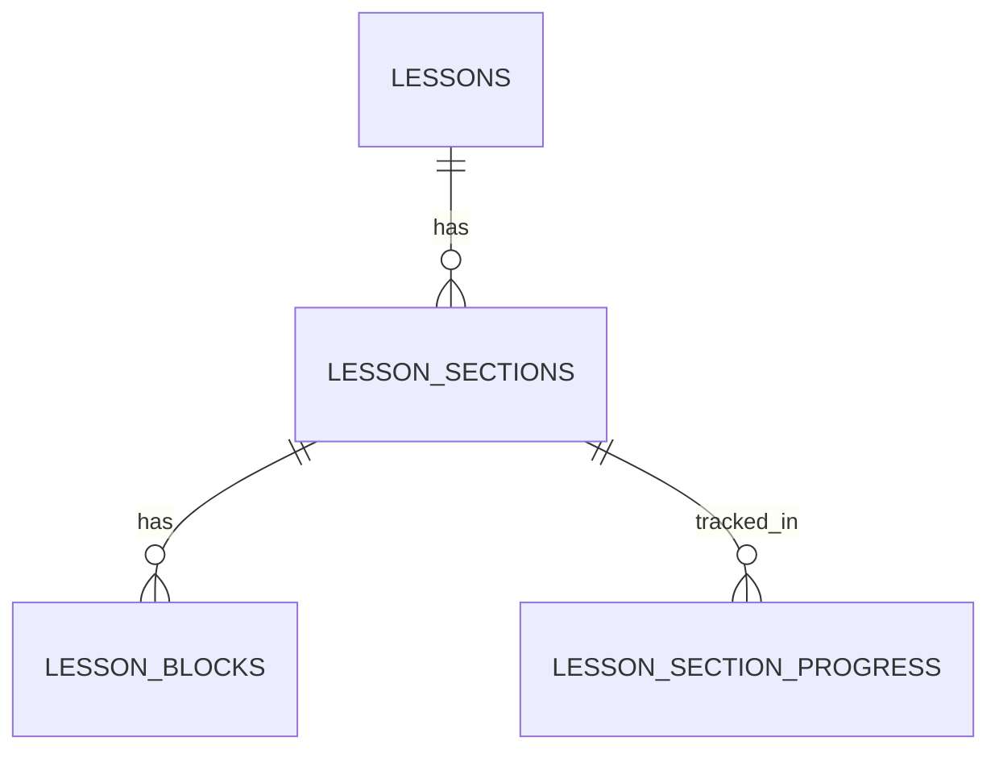
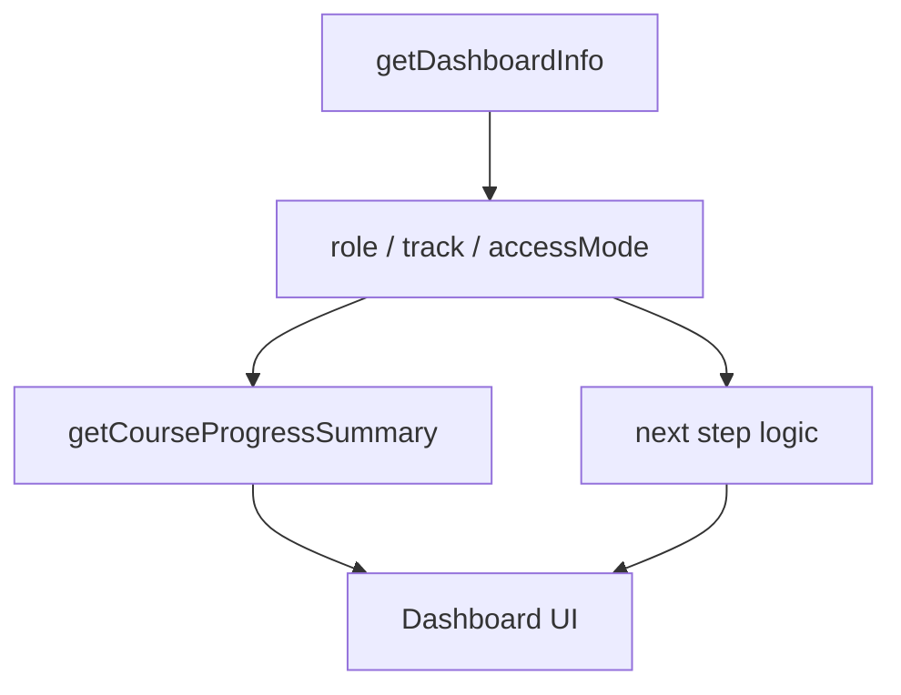

# Architecture Overview

This document describes the current system architecture of the GCSE
Russian Course Platform.

It reflects the **latest system design**, including the evolution of the
lesson builder into a full CMS and major UX improvements introduced in
this phase.

---

## 1. Architectural model

The platform is shaped by **two independent axes**:

### Role axis

- Admin
- Teacher
- Student

### Student access axis

- Trial
- Self-study / Full
- Volna student

These axes are intentionally separated.

The system uses:

- one codebase
- one database
- one content model

Different experiences are produced through:

- permissions
- access logic
- UI variation

NOT separate applications.

---

## 2. High-level system architecture

(unchanged diagram retained)

---

## 3. Main architectural layers

### Presentation layer

Built with Next.js App Router and React.

Responsibilities:

- dashboards
- course navigation
- lesson rendering
- assignment UI
- teacher review UI
- admin CMS UI
- lesson builder UI (expanded significantly)
- **role-aware navigation (NEW)**
- **account and settings UI (NEW)**

---

### Application logic layer

Implemented via:

- server actions
- helper modules (`src/lib/`)

Responsibilities:

- authenticated writes
- role-aware logic
- lesson progression logic
- question rendering
- assignment workflows
- CMS orchestration
- lesson builder orchestration (expanded)
- **dashboard orchestration (NEW)**
- **access-aware UI decisions (NEW)**

---

### Data layer

Supabase:

- PostgreSQL
- authentication
- storage
- row-level security

---

## 4. Core content architecture

### Course hierarchy

- Course
- Variant
- Module
- Lesson

### Lesson architecture (UPDATED)

- Lesson
- Section
- Block

This is now the **single source of truth for lesson structure**.

---

## 5. Section-based lesson flow

Sections enable:

- step-based learning
- progressive unlocking
- structured pacing
- better UX for long lessons

### Behaviour

- first visit recorded
- visit unlocks next section
- revisit allowed
- skipping prevented

### Key decision

Progression is **visit-based**, not completion-based.

---

## 6. Block system (EXPANDED)

Blocks represent atomic content units.

Supported types:

- text
- note
- vocabulary
- audio
- image
- callout
- exam tip
- header
- subheader
- divider
- question set

### Design principles

- small, composable units
- reusable rendering
- DB-driven configuration
- no hardcoded layouts

---

## 7. Lesson Builder Architecture (CORE SYSTEM)

The lesson builder is now a **central CMS**, not a helper tool.

### Core responsibilities

- write lesson content directly to DB
- manage structure (sections + blocks)
- control ordering
- manage publishing state

### Capabilities

- section CRUD
- block CRUD
- drag-and-drop ordering
- cross-section block movement
- duplication
- publish/unpublish
- inspector editing
- sidebar navigation

---

## 8. Lesson Builder UX Architecture (NEW)

This phase introduced **major UX-driven structural improvements**.

### Key shift

From:

- list-first editing

To:

- creation-first workflow

---

### Block creation flow

- block composer moved above block list
- clear creation entry point
- improved empty states
- faster first-block experience

---

### Composer architecture

- block types grouped:
  - structure
  - teaching
  - media
  - practice
- selection-driven UI:
  - choose type
  - form appears inline
- presets:
  - DB-driven
  - reusable starter structures

---

### Section editor structure

Now organised into:

1. Section overview panel
2. Metadata editing (collapsible)
3. Block creation (primary)
4. Block list (secondary)

This reflects actual author workflow.

---

### Block list architecture

Each block is:

- selectable (inspector-driven editing)
- draggable (reordering + cross-section movement)
- state-aware (selected, drop target, pending)

Improved behaviours:

- strong visual selection state
- better scanning (labels + previews)
- inline actions (move, duplicate, publish)

---

## 9. Progress architecture

### Tables

- lesson_progress → completion
- lesson_section_progress → visitation

Tracks:

- first_visited_at
- last_visited_at
- visit_count

### Key decision

Progress is:

- **event-based (visit)**
- not button-driven

---

## 10. Database relationships



---

## 11. Navigation & UI Access Architecture (NEW)

A dedicated layer now exists to control what users see, separate from backend permissions.

### Sidebar architecture

Navigation is composed of:

- **Main items** → always visible core features
- **Conditional items** → based on access mode
- **Utility section** → profile, settings, logout

### Conditional rendering logic

```text
role + accessMode → visible navigation
```

Examples:

- **Volna student**
  - sees → Assignments
  - does NOT see → Online Classes

- **Non-Volna student**
  - sees → Online Classes
  - does NOT see → Assignments

### Key architectural principle

UI visibility is:

- **derived from access state**
- not hardcoded per page

This ensures:

- scalability
- consistent UX
- correct product funnel behaviour

---

## 12. Dashboard Architecture (NEW)

The dashboard is now a **state-aware orchestration layer**, not just a static page.

### Responsibilities

- aggregate user state:
  - role
  - track
  - access mode
- fetch progress data
- determine next actions
- render role-specific UI

### Data flow



### Current capabilities

- role-based rendering:
  - guest
  - student
  - teacher
  - admin
- access-aware messaging
- progress display
- next-step guidance (V1)

### Design constraints (important)

- no dependency on exact lesson sequencing
- no heavy progression logic
- safe, additive layer

This enables future expansion without breaking existing flows.

---

## 13. Account System Architecture (NEW)

### Profile system

- stored in user profile table
- includes:
  - full_name
  - avatar_key

### Avatar system

- preset-based (no uploads)
- selected via key
- UI-driven, not storage-heavy

Design benefits:

- safe for younger users
- consistent UI
- no moderation/storage issues

### Settings system

- separate route (`/settings`)
- designed for future:
  - email updates
  - password updates
  - account controls

---

## 14. Architectural changes in this phase

### New systems introduced

- Dashboard orchestration layer
- Sidebar access-aware navigation system
- Account/profile system (`avatar_key`)
- Online Classes integration layer

### Systems extended

UI now reacts dynamically to:

- role
- access mode
- track
- progress

### Systems stabilised

- access logic (fixed admin access regression)
- route-based visibility
- component structure consistency

---

## 15. Architectural strengths

- single unified system
- DB-driven content
- scalable CMS
- flexible learning flows
- clean separation of concerns
- clear separation of data logic vs UI logic (improved)
- access-aware UI without duplicating apps

---

## 16. Next architectural steps

### Dashboard

- true lesson continuation system
- module-level progress tracking
- personalised recommendations

### Navigation

- dynamic highlighting based on progress
- deeper integration with course state

### Builder

- autosave
- inline insertion ("+ between blocks")
- faster editing workflows

### Content

- more block types
- richer interactivity
- reusable templates

### Platform

- analytics
- payments
- speaking workflows
