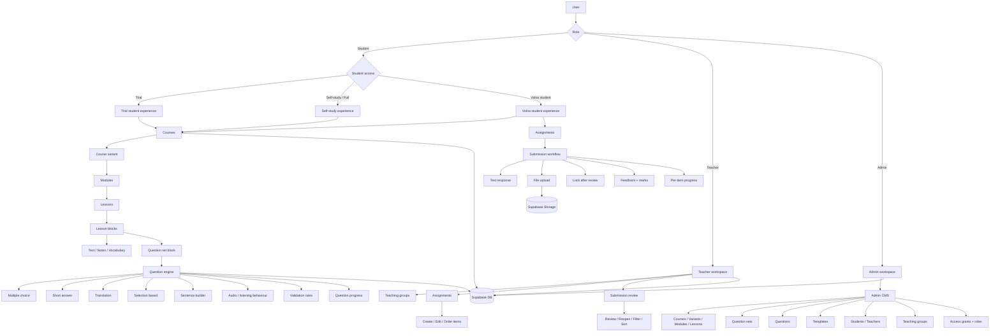
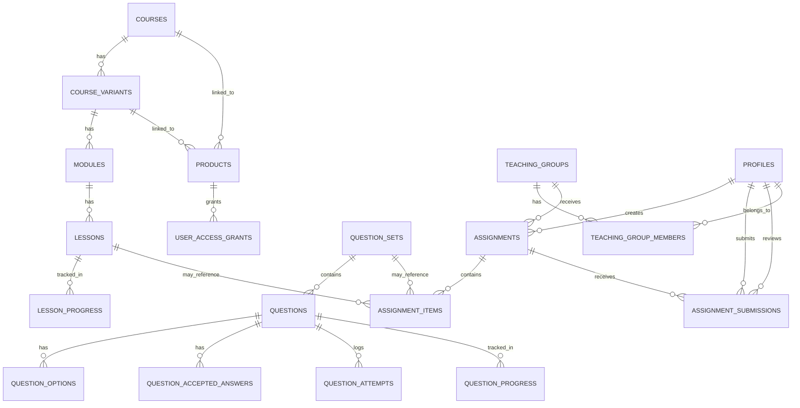

# Architecture Overview

This document describes the current system architecture of the GCSE Russian Course Platform.

It focuses on how the platform is organised today rather than trying to list every implementation detail.

---

## 1. Architectural model

The platform is shaped by **two separate axes**:

### Role axis

- Admin
- Teacher
- Student

### Student access axis

- Trial
- Self-study / Full
- Volna student

This distinction matters because the platform does not use separate apps for each student type. Instead, one codebase serves multiple student experiences through access logic, permissions, and UI differences.

---

## 2. High-level system architecture



---

## 3. Main architectural layers

### Presentation layer

Built with Next.js App Router and React.

Main concerns:

- dashboards
- course navigation
- lesson rendering
- student assignment views
- teacher review views
- admin authoring views

### Application logic layer

Implemented through server actions and helper modules in `src/lib/`.

Main concerns:

- authenticated writes
- data loading
- role-aware helpers
- assignment workflow logic
- question transformation and rendering support
- admin CMS orchestration

### Data layer

Supabase provides:

- PostgreSQL
- authentication
- storage
- row-level security

---

## 4. Core content architecture

### Course hierarchy

- Course
- Variant
- Module
- Lesson

### Content management architecture

Content is now administered through a contextual admin CMS.

The navigation flow is:

- Course list
- Course detail
- Variant detail
- Module detail
- Lesson detail

This preserves parent-child context while still allowing reuse and future expansion.

### Lesson architecture

Lessons are block-based rather than page-specific.

That means a lesson is composed from reusable block types such as:

- text
- note
- vocabulary
- audio
- question set block

This keeps layout logic reusable and allows lesson content to grow without rewriting page structure.

### Question architecture

Questions are database-driven and metadata-driven.

The engine is built so one rendering system can support many behaviours, rather than one custom component per question variation.

This supports:

- multiple choice
- short answer
- translation
- selection-based workflows
- listening rules
- sentence-builder style interactions

---

## 5. Assignment architecture

The assignment system now works as a full teacher-student workflow.

### Assignment entities

- `assignments`
- `assignment_items`
- `assignment_submissions`

### Assignment item types

- lesson
- question set
- custom task

### Current workflow

Teachers can:

- create assignments
- edit assignments
- order assignment items
- review submissions
- save marks and feedback
- reopen reviewed submissions
- filter and sort review queues

Students can:

- view assignments
- follow ordered items
- submit text and optional files
- get locked after review
- see review results
- see per-item progress

### Important implementation detail

Teacher-facing assignment status is **derived from submission data**, not trusted from an assignment-level label alone.

That enables states such as:

- no submissions
- pending review
- reviewed

This is more useful operationally than a flat assignment status field.

---

## 6. Progress architecture

Progress currently exists in more than one place because different kinds of work need different tracking.

### Lesson progress

Stored in `lesson_progress`.

Used for:

- completed lesson state
- assignment lesson item progress

### Question progress

Stored through:

- `question_attempts`
- `question_progress`

Used for:

- question activity
- score history
- question-set started state
- assignment question set progress

### Assignment progress

Assignment progress is currently assembled from the underlying learning systems rather than stored as a single separate progress record.

That means:

- lesson items use lesson completion
- question set items use question activity
- custom tasks remain teacher-defined work without automatic completion tracking

### Access switching and progress

Progress is intentionally separate from access grants.

This means changing a student's active access does not need to delete or rewrite historical progress, which is especially important for variant-aware learning paths.

---

## 7. Admin content and operations system

The platform now has two distinct admin surfaces under one CMS direction.

### Content CMS

Supports:

- course CRUD
- variant CRUD
- module CRUD
- lesson CRUD shell
- reordering for variants, modules, and lessons
- contextual navigation and dedicated edit pages
- public-view shortcuts

### Operational admin tools

Supports:

- question set and question management
- student account views
- teacher account views
- teaching group creation and editing
- teaching group membership management
- access-grant switching
- teacher-role toggling
- dashboard summary widgets
- success/error banners and destructive-action confirmations

---

## 8. Access and permission architecture

### Role handling

- admin visibility uses `profiles.is_admin`
- teacher role uses `profiles.is_teacher`
- teaching-group membership role uses `teaching_group_members.member_role`
- student access is default authenticated access

### Access modes

Student experience is additionally shaped by product/access rules such as:

- trial
- full
- volna

### Security model

Security is enforced through a combination of:

- route-level checks
- helper-level permission-aware queries
- Row Level Security policies in Supabase

This is why some helper functions include admin-aware logic even when route access is already gated.

### Important admin security detail

Recent admin CMS work required explicit admin RLS support for:

- profiles
- user_access_grants
- teaching_groups
- teaching_group_members

This made role switching, access switching, and teaching-group management behave as true admin workflows rather than read-only views.

---

## 9. Database relationships



---

## 10. Representative file structure

This is intentionally representative rather than exhaustive.

```text
src/
  app/
    (platform)/
      dashboard/
      courses/
      assignments/
      teacher/
      question-sets/
    admin/
      content/
      question-sets/
      students/
      teachers/
      teaching-groups/
    actions/

  components/
    admin/
    assignments/
    layout/
    lesson-blocks/
    questions/
    ui/

  lib/
    access.ts
    access-helpers-db.ts
    admin-user-helpers-db.ts
    assignment-helpers-db.ts
    assignment-progress.ts
    auth.ts
    course-helpers-db.ts
    dashboard-helpers.ts
    progress.ts
    question-engine.ts
    question-helpers-db.ts
    question-progress.ts
    routes.ts
    storage-helpers.ts
    teacher-auth.ts
    supabase/

  types/
```

---

## 11. Tech stack

- Next.js (App Router)
- React
- TypeScript
- Tailwind CSS
- Supabase
- Server Actions

---

## 12. Current architectural strengths

The platform now has several strong foundations:

- one shared system for multiple student experiences
- reusable lesson renderer
- reusable metadata-driven question engine
- real teacher assignment workflow
- admin CMS for both content and operational workflows
- security model aligned across route checks, helpers, and RLS
- assignment UX that reflects operational review state rather than raw record status
- teacher-role and access-grant systems that are explicit rather than inferred ad hoc

---

## 13. Likely next architectural evolutions

The current architecture is strong enough to support future additions such as:

- database-driven lesson authoring
- lesson block management from admin
- section-based or step-based lesson flow UX
- payments and billing-driven access
- speaking workflows
- richer analytics
- deeper progress summaries
- broader admin content operations
